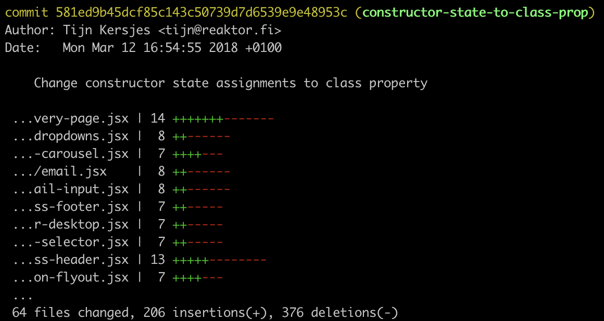

title: "Codemods"
controls: false
progress: true
numbers: true
theme: tkers/cleaver-theme-sunset
--

# Codemods
## Refactoring JavaScript with JavaScript


### 🙋‍♂️ Tijn Kersjes

--

### 🙋‍♂️ Tijn Kersjes

- Software engineer at **Reaktor** Amsterdam

<center>
  
</center>


- Writing Node.js, React & TypeScript by day
- Tinkering with compilers by night
- [github.com/**tkers**](https://github.com/tkers)

--

### What are codemods?

- Also called program **transformations**
- Metaprogramming
  - Automatise programming / refactoring
- Can be applied to your entire code base
- Modifies program using its **AST**

--

### Basic code refactoring

Function name is updated:

```diff
export {
-  foo
+  bar
}
```

Find and replace 💪

```diff
import {
-  foo
+  bar
} from './myLib.js'

// ...

- foo()
+ bar()
```
--

### However...

No access to the **semantics** of your code:

```js
import { foo as fooA } from './myLib.js'
import { foo as fooB } from './otherLib.js'

obj.foo = 42

sendMessage('foo')
```

--

### Changing code structure

Binding manually:

```js
class MyComponent extends React.Component {
  constructor() {
    this.handleClick = this.handleClick.bind(this)
  }

  handleClick() {
    this.setState({ open: true })
  }
}
```

Using arrow function as class property:

```js
class MyComponent extends React.Component {
  handleClick = () => this.setState({ open: true })
}
```

Modify the **program** instead of **text**!

--

### Abstract Syntax Tree 🌲

```js
class MyComponent extends React.Component {
  constructor() {
    this.handleClick = this.handleClick.bind(this)
  }

  handleClick() {
    this.setState({ open: true })
  }
}
```

- ClassDeclaration `MyComponent`
  - MethodDefinition `constructor`
    - AssignmentExpression `=`
      - MemberExpression `this.handleClick`
      - CallExpression `bind()`
  - MethodDefinition `handleClick`
    - CallExpression `setState()`

--

### AST Explorer

[astexplorer.net](https://astexplorer.net)

--

### Now what? 🤔

Tools using the AST:
- **ESLint** reads (and reports issues)
- **Prettier** reprints (ignoring whitespaces)
- **Babel** transforms (ES6 to ES5)
- ...

--

### JSCodeshift

- AST transformation tool
- Wrapper around **Recast**
  - Preserves formatting
- Update React APIs

--

### Basic transformation

```js
export default function transform(file, api) {
  const j = api.jscodeshift
  const root = j(file.source)

  // ...transform root

  return root.toSource()
}
```

--

### Our codebase

- 100 KLOC
- 50 developers
- 20 merges/day
- A lot of time pressure 💩

--

State assignment in constructor:

```js
class MyComponent extends React.Component {
  constructor() {
    this.state = {
      foo: 'hello',
      bar: 42
    }
  }
}
```

State as class property:


```js
class MyComponent extends React.Component {
  state = {
    foo: 'hello',
    bar: 42
  }
}
```

--

### State-to-class-property transform

```js
export default function transform(file, api) {
  const j = api.jscodeshift
  const root = j(file.source)

  root
    .find(j.ClassDeclaration)
    .find(j.MethodDefinition, { kind: 'constructor' })
    .find(j.AssignmentExpression, {
      left: {
        object: j.ThisExpression,
        property: { name: 'state' }
      }
    })
    .forEach(stateAssignment => {
      const initialState = stateAssignment.node.right
      const asProperty = j.classProperty(j.identifier('state'), initialState, null, false)

      j(stateAssignment)
        .closest(j.ClassBody)
        .get('body')
        .insertAt(0, asProperty)

      j(stateAssignment).remove()
    })

  return root.toSource()
}
```

--

### Resulting code 🙌

*Almost* what we wanted:

```js
class MyComponent extends React.Component {
  state = {
    foo: 'hello',
    bar: 42
  }
  constructor() {}
}
```

--

### More transformations!

- Remove empty constructor
- Compose with other transforms
- [astexplorer.net](https://astexplorer.net)

--

### Apply it to the repo 🤞

- Manual `git diff` check
- Automated tests



--

### Some important painpoints

- Documentation is scarce
- JSCodeshift API a bit confusing
- JavaScript is messy
  - A lot of edge cases
  - Focus on the 99%

--

### Super fast refactoring 🚀

- Wow-factor
- Updating function interfaces
- Postpone design decisions

-- dark

# That's it for today 👌
- [astexplorer.net](https://astexplorer.net)
- [facebook/jscodeshift](https://github.com/facebook/jscodeshift)
- [reactjs/react-codemod](https://github.com/reactjs/react-codemod)
- [cpojer/js-codemod](https://github.com/cpojer/js-codemod)


- **[reaktor.com/careers](https://reaktor.com/careers)**


